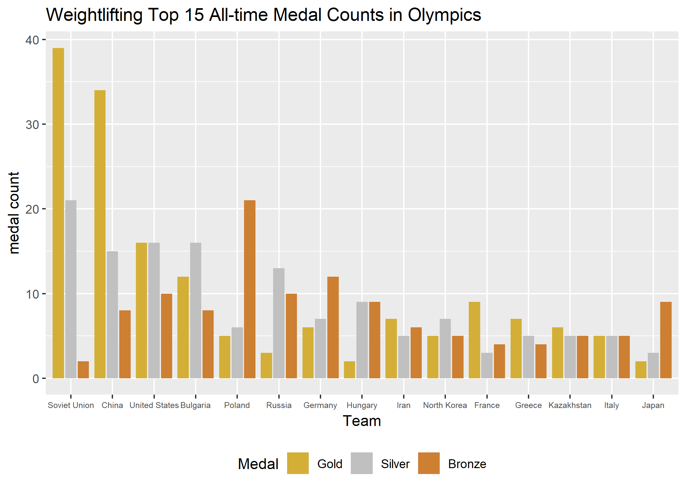
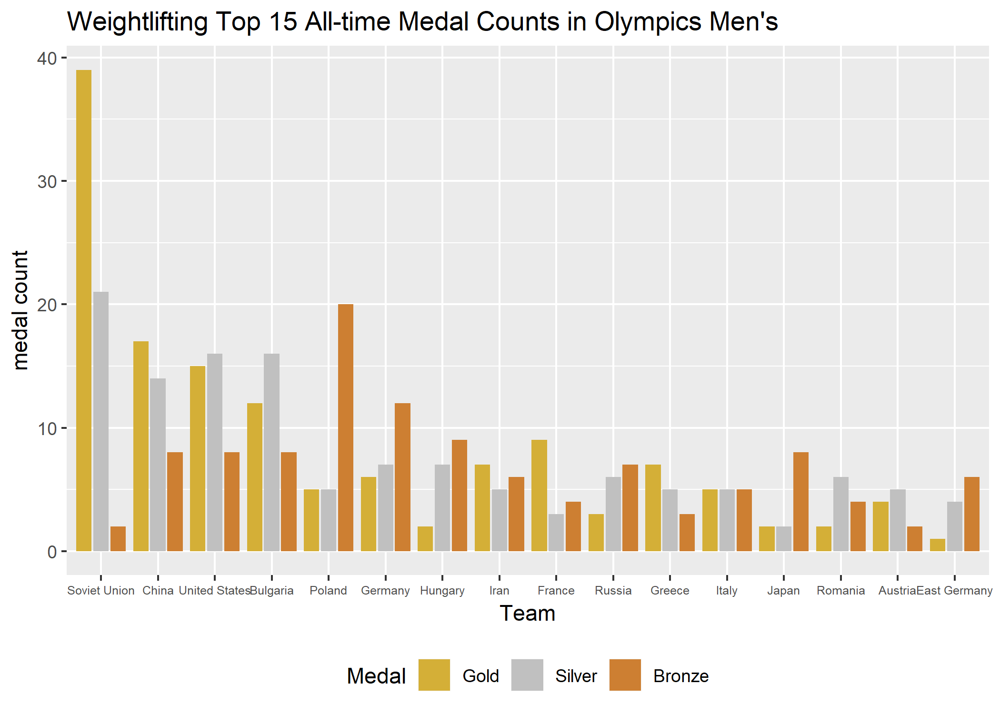
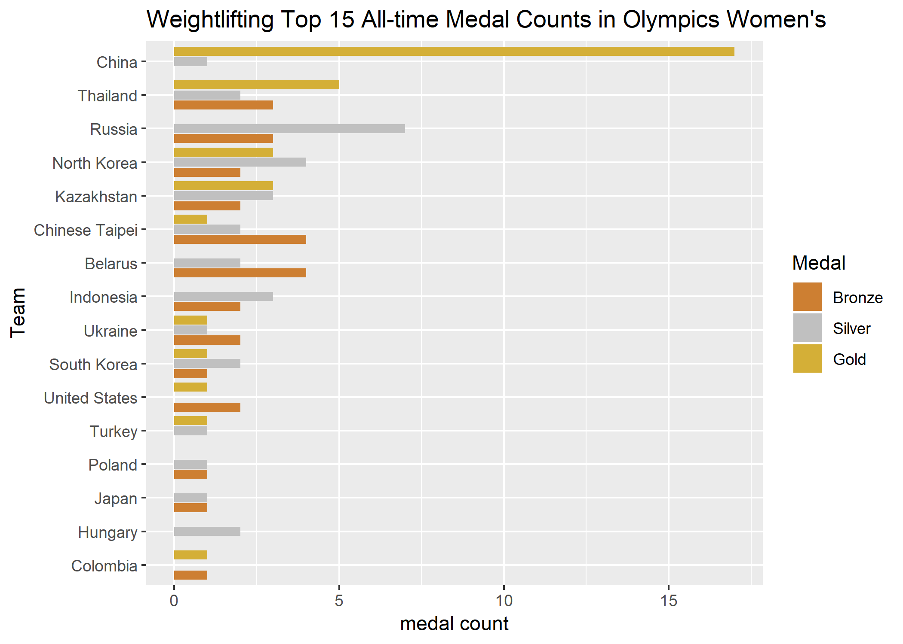
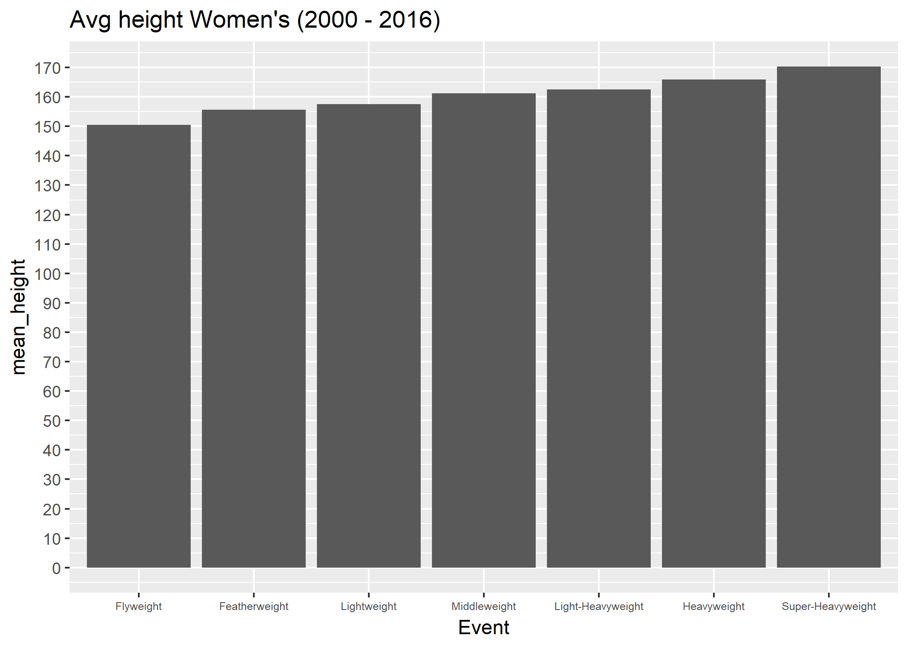
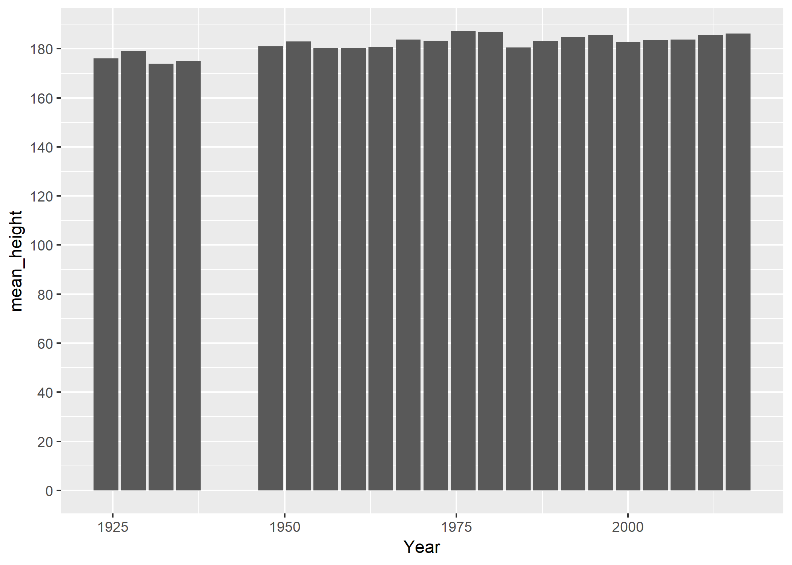
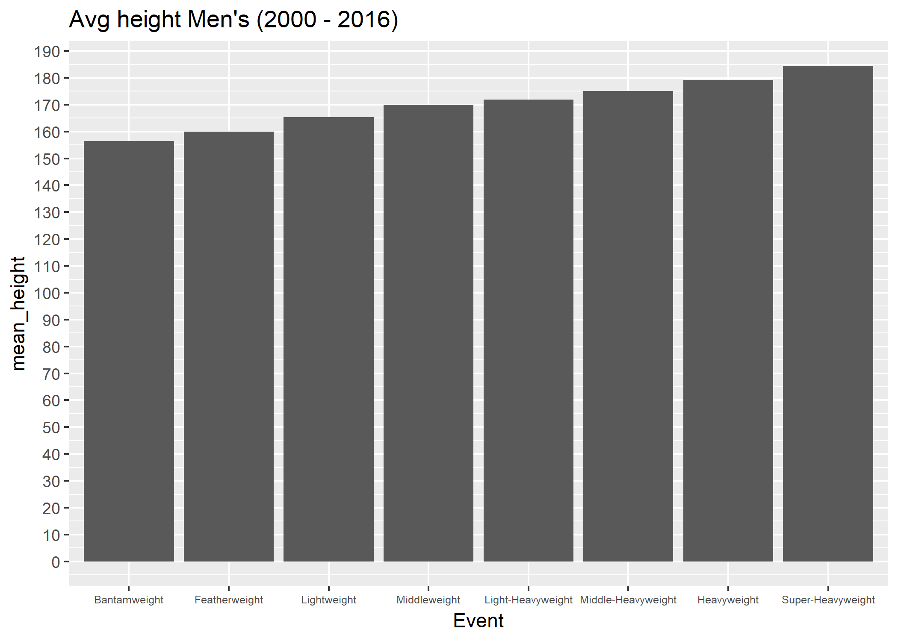

Olympic Weightlifting
================
Christopher Oh
2018-09-14

-   [Set Up](#set-up)
    -   [Library](#library)
    -   [Data](#data)
    -   [Color](#color)
-   [Medal Counts](#medal-counts)
    -   [By country](#by-country)
    -   [Most decorated athletes](#most-decorated-athletes)
-   [Heights](#heights)
    -   [Height in each of the most recent weight classes Men's (2000 - 2016)](#height-in-each-of-the-most-recent-weight-classes-mens-2000---2016)
    -   [Height in each of the most recent weight classes Women's (2000 - 2016)](#height-in-each-of-the-most-recent-weight-classes-womens-2000---2016)
    -   [Height of the superheavies over the years](#height-of-the-superheavies-over-the-years)
-   [Weights](#weights)
    -   [Avg weight of superheavies over the years](#avg-weight-of-superheavies-over-the-years)

Set Up
------

#### Library

``` r
library(tidyverse)
```

    ## -- Attaching packages --------------------------------------------------------------------------- tidyverse 1.2.1.9000 --

    ## √ ggplot2 3.0.0.9000     √ purrr   0.2.5     
    ## √ tibble  1.4.2          √ dplyr   0.7.5     
    ## √ tidyr   0.8.1          √ stringr 1.3.1     
    ## √ readr   1.1.1          √ forcats 0.3.0

    ## -- Conflicts ----------------------------------------------------------------------------------- tidyverse_conflicts() --
    ## x dplyr::filter() masks stats::filter()
    ## x dplyr::lag()    masks stats::lag()

``` r
library(knitr)
library(kableExtra)
```

    ## Warning: package 'kableExtra' was built under R version 3.5.1

#### Data

``` r
weightlifting <- 
  read_csv(path_athlete) %>% 
  filter(Sport %in% "Weightlifting") 
```

    ## Parsed with column specification:
    ## cols(
    ##   ID = col_integer(),
    ##   Name = col_character(),
    ##   Sex = col_character(),
    ##   Age = col_integer(),
    ##   Height = col_integer(),
    ##   Weight = col_double(),
    ##   Team = col_character(),
    ##   NOC = col_character(),
    ##   Games = col_character(),
    ##   Year = col_integer(),
    ##   Season = col_character(),
    ##   City = col_character(),
    ##   Sport = col_character(),
    ##   Event = col_character(),
    ##   Medal = col_character()
    ## )

#### Color

``` r
MEDAL_COLOR <- c(
  Gold = "#d4af37",
  Silver = "#c0c0c0",
  Bronze = "#cd7f32"
)
```

Medal Counts
------------

#### By country

``` r
weightlifting %>%
  count(Team, Medal) %>% 
  filter(!is.na(Medal)) %>%
  # group_by(Team) %>% 
  # mutate(medal_count = sum(n))
  spread(Medal, n, fill = 0) %>% 
  mutate(Total = Bronze + Gold + Silver) %>%
  top_n(15, wt = Total) %>% 
  gather(Medal, `medal count`, Bronze:Silver) %>% 
  mutate(
    Team = fct_reorder(Team, -Total),
    Medal = fct_relevel(Medal, "Gold", "Silver")
  ) %>% 
  ggplot(aes(Team, `medal count`, fill = Medal)) +
  geom_col(position = position_dodge2()) +
  scale_fill_manual(values = MEDAL_COLOR) +
  labs(title = "Weightlifting Top 15 All-time Medal Counts in Olympics") +
  theme(
    legend.position = "bottom",
    axis.text.x = element_text(size = 6)
  )
```



``` r
weightlifting %>%
  filter(Sex %in% "M") %>%
  count(Team, Medal) %>% 
  filter(!is.na(Medal)) %>%
  # group_by(Team) %>% 
  # mutate(medal_count = sum(n))
  spread(Medal, n, fill = 0) %>% 
  mutate(Total = Bronze + Gold + Silver) %>%
  top_n(15, wt = Total) %>% 
  gather(Medal, `medal count`, Bronze:Silver) %>% 
  mutate(
    Team = fct_reorder(Team, -Total),
    Medal = fct_relevel(Medal, "Gold", "Silver")
  ) %>% 
  ggplot(aes(Team, `medal count`, fill = Medal)) +
  geom_col(position = position_dodge2()) +
  scale_fill_manual(values = MEDAL_COLOR) +
  labs(title = "Weightlifting Top 15 All-time Medal Counts in Olympics Men's") +
    theme(
    legend.position = "bottom",
    axis.text.x = element_text(size = 6)
  )
```



``` r
# horizontal flip Total and medal level
weightlifting %>% 
  filter(Sex %in% "F") %>%
  count(Team, Medal) %>% 
  filter(!is.na(Medal)) %>%
  # group_by(Team) %>% 
  # mutate(medal_count = sum(n))
  spread(Medal, n, fill = 0) %>% 
  mutate(Total = Bronze + Gold + Silver) %>%
  top_n(15, wt = Total) %>% 
  gather(Medal, `medal count`, Bronze:Silver) %>% 
  mutate(
    Team = fct_reorder(Team, Total),
    Medal = fct_relevel(Medal, "Bronze", "Silver")
  ) %>% 
  ggplot(aes(Team, `medal count`, fill = Medal)) +
  geom_col(position = position_dodge2()) +
  scale_fill_manual(values = MEDAL_COLOR) +
  labs(title = "Weightlifting Top 15 All-time Medal Counts in Olympics Women's") +
  coord_flip()
```



#### Most decorated athletes

``` r
weightlifting %>% 
  filter(!is.na(Medal)) %>%
  count(Name, Medal) %>% 
  spread(Medal, n, fill = 0) %>% 
  mutate(Total = Bronze + Gold + Silver) %>% 
  select(Name, Total, Gold, Silver, Bronze) %>% 
  top_n(10, wt = Total) %>% 
  kable(caption = "Most Medals")
```

<table>
<caption>
Most Medals
</caption>
<thead>
<tr>
<th style="text-align:left;">
Name
</th>
<th style="text-align:right;">
Total
</th>
<th style="text-align:right;">
Gold
</th>
<th style="text-align:right;">
Silver
</th>
<th style="text-align:right;">
Bronze
</th>
</tr>
</thead>
<tbody>
<tr>
<td style="text-align:left;">
Akakios Kakiasvili
</td>
<td style="text-align:right;">
3
</td>
<td style="text-align:right;">
3
</td>
<td style="text-align:right;">
0
</td>
<td style="text-align:right;">
0
</td>
</tr>
<tr>
<td style="text-align:left;">
Arkady Nikitich Vorobyov
</td>
<td style="text-align:right;">
3
</td>
<td style="text-align:right;">
2
</td>
<td style="text-align:right;">
0
</td>
<td style="text-align:right;">
1
</td>
</tr>
<tr>
<td style="text-align:left;">
Carlo Galimberti
</td>
<td style="text-align:right;">
3
</td>
<td style="text-align:right;">
1
</td>
<td style="text-align:right;">
2
</td>
<td style="text-align:right;">
0
</td>
</tr>
<tr>
<td style="text-align:left;">
Eko Yuli Irawan
</td>
<td style="text-align:right;">
3
</td>
<td style="text-align:right;">
0
</td>
<td style="text-align:right;">
1
</td>
<td style="text-align:right;">
2
</td>
</tr>
<tr>
<td style="text-align:left;">
Halil Mutlu
</td>
<td style="text-align:right;">
3
</td>
<td style="text-align:right;">
3
</td>
<td style="text-align:right;">
0
</td>
<td style="text-align:right;">
0
</td>
</tr>
<tr>
<td style="text-align:left;">
Imre Fldi
</td>
<td style="text-align:right;">
3
</td>
<td style="text-align:right;">
1
</td>
<td style="text-align:right;">
2
</td>
<td style="text-align:right;">
0
</td>
</tr>
<tr>
<td style="text-align:left;">
Isaac "Ike" Berger
</td>
<td style="text-align:right;">
3
</td>
<td style="text-align:right;">
1
</td>
<td style="text-align:right;">
2
</td>
<td style="text-align:right;">
0
</td>
</tr>
<tr>
<td style="text-align:left;">
Louis Hostin
</td>
<td style="text-align:right;">
3
</td>
<td style="text-align:right;">
2
</td>
<td style="text-align:right;">
1
</td>
<td style="text-align:right;">
0
</td>
</tr>
<tr>
<td style="text-align:left;">
Manfred Nerlinger
</td>
<td style="text-align:right;">
3
</td>
<td style="text-align:right;">
0
</td>
<td style="text-align:right;">
1
</td>
<td style="text-align:right;">
2
</td>
</tr>
<tr>
<td style="text-align:left;">
Marian Zieliski
</td>
<td style="text-align:right;">
3
</td>
<td style="text-align:right;">
0
</td>
<td style="text-align:right;">
0
</td>
<td style="text-align:right;">
3
</td>
</tr>
<tr>
<td style="text-align:left;">
Mohammad Nassiri Seresht
</td>
<td style="text-align:right;">
3
</td>
<td style="text-align:right;">
1
</td>
<td style="text-align:right;">
1
</td>
<td style="text-align:right;">
1
</td>
</tr>
<tr>
<td style="text-align:left;">
Naim Sleymanolu
</td>
<td style="text-align:right;">
3
</td>
<td style="text-align:right;">
3
</td>
<td style="text-align:right;">
0
</td>
<td style="text-align:right;">
0
</td>
</tr>
<tr>
<td style="text-align:left;">
Nicolae "Nicu" Vlad
</td>
<td style="text-align:right;">
3
</td>
<td style="text-align:right;">
1
</td>
<td style="text-align:right;">
1
</td>
<td style="text-align:right;">
1
</td>
</tr>
<tr>
<td style="text-align:left;">
Nikolaj Pealov
</td>
<td style="text-align:right;">
4
</td>
<td style="text-align:right;">
1
</td>
<td style="text-align:right;">
1
</td>
<td style="text-align:right;">
2
</td>
</tr>
<tr>
<td style="text-align:left;">
Norbert "Norb" Schemansky
</td>
<td style="text-align:right;">
4
</td>
<td style="text-align:right;">
1
</td>
<td style="text-align:right;">
1
</td>
<td style="text-align:right;">
2
</td>
</tr>
<tr>
<td style="text-align:left;">
Peter T. "Pete" George
</td>
<td style="text-align:right;">
3
</td>
<td style="text-align:right;">
1
</td>
<td style="text-align:right;">
2
</td>
<td style="text-align:right;">
0
</td>
</tr>
<tr>
<td style="text-align:left;">
Pyrros Dimas
</td>
<td style="text-align:right;">
4
</td>
<td style="text-align:right;">
3
</td>
<td style="text-align:right;">
0
</td>
<td style="text-align:right;">
1
</td>
</tr>
<tr>
<td style="text-align:left;">
Ronny Weller
</td>
<td style="text-align:right;">
4
</td>
<td style="text-align:right;">
1
</td>
<td style="text-align:right;">
2
</td>
<td style="text-align:right;">
1
</td>
</tr>
<tr>
<td style="text-align:left;">
Tamio "Tommy" Kono
</td>
<td style="text-align:right;">
3
</td>
<td style="text-align:right;">
2
</td>
<td style="text-align:right;">
1
</td>
<td style="text-align:right;">
0
</td>
</tr>
<tr>
<td style="text-align:left;">
Yoshinobu Miyake
</td>
<td style="text-align:right;">
3
</td>
<td style="text-align:right;">
2
</td>
<td style="text-align:right;">
1
</td>
<td style="text-align:right;">
0
</td>
</tr>
</tbody>
</table>
``` r
weightlifting %>% 
  filter(Medal %in% "Gold") %>% 
  count(Name, Medal) %>% 
  top_n(10, wt = n) %>% 
  arrange(desc(n)) %>% 
  kable(caption = "Most Golds")
```

<table>
<caption>
Most Golds
</caption>
<thead>
<tr>
<th style="text-align:left;">
Name
</th>
<th style="text-align:left;">
Medal
</th>
<th style="text-align:right;">
n
</th>
</tr>
</thead>
<tbody>
<tr>
<td style="text-align:left;">
Akakios Kakiasvili
</td>
<td style="text-align:left;">
Gold
</td>
<td style="text-align:right;">
3
</td>
</tr>
<tr>
<td style="text-align:left;">
Halil Mutlu
</td>
<td style="text-align:left;">
Gold
</td>
<td style="text-align:right;">
3
</td>
</tr>
<tr>
<td style="text-align:left;">
Naim Sleymanolu
</td>
<td style="text-align:left;">
Gold
</td>
<td style="text-align:right;">
3
</td>
</tr>
<tr>
<td style="text-align:left;">
Pyrros Dimas
</td>
<td style="text-align:left;">
Gold
</td>
<td style="text-align:right;">
3
</td>
</tr>
<tr>
<td style="text-align:left;">
Aleksandr Nikolayevich Kurlovich
</td>
<td style="text-align:left;">
Gold
</td>
<td style="text-align:right;">
2
</td>
</tr>
<tr>
<td style="text-align:left;">
Arkady Nikitich Vorobyov
</td>
<td style="text-align:left;">
Gold
</td>
<td style="text-align:right;">
2
</td>
</tr>
<tr>
<td style="text-align:left;">
Charles Thomas "Chuck" Vinci, Jr.
</td>
<td style="text-align:left;">
Gold
</td>
<td style="text-align:right;">
2
</td>
</tr>
<tr>
<td style="text-align:left;">
Chen Yanqing
</td>
<td style="text-align:left;">
Gold
</td>
<td style="text-align:right;">
2
</td>
</tr>
<tr>
<td style="text-align:left;">
Hossein Reza Zadeh
</td>
<td style="text-align:left;">
Gold
</td>
<td style="text-align:right;">
2
</td>
</tr>
<tr>
<td style="text-align:left;">
Ilya Aleksandrovich Ilyin
</td>
<td style="text-align:left;">
Gold
</td>
<td style="text-align:right;">
2
</td>
</tr>
<tr>
<td style="text-align:left;">
John Henry Davis, Jr.
</td>
<td style="text-align:left;">
Gold
</td>
<td style="text-align:right;">
2
</td>
</tr>
<tr>
<td style="text-align:left;">
Leonid Ivanovych Zhabotynskiy
</td>
<td style="text-align:left;">
Gold
</td>
<td style="text-align:right;">
2
</td>
</tr>
<tr>
<td style="text-align:left;">
Liu Chunhong
</td>
<td style="text-align:left;">
Gold
</td>
<td style="text-align:right;">
2
</td>
</tr>
<tr>
<td style="text-align:left;">
Long Qingquan
</td>
<td style="text-align:left;">
Gold
</td>
<td style="text-align:right;">
2
</td>
</tr>
<tr>
<td style="text-align:left;">
Louis Hostin
</td>
<td style="text-align:left;">
Gold
</td>
<td style="text-align:right;">
2
</td>
</tr>
<tr>
<td style="text-align:left;">
Norayr Aram Nurikyan
</td>
<td style="text-align:left;">
Gold
</td>
<td style="text-align:right;">
2
</td>
</tr>
<tr>
<td style="text-align:left;">
Rim Jong-Sim
</td>
<td style="text-align:left;">
Gold
</td>
<td style="text-align:right;">
2
</td>
</tr>
<tr>
<td style="text-align:left;">
Shi Zhiyong
</td>
<td style="text-align:left;">
Gold
</td>
<td style="text-align:right;">
2
</td>
</tr>
<tr>
<td style="text-align:left;">
Tamio "Tommy" Kono
</td>
<td style="text-align:left;">
Gold
</td>
<td style="text-align:right;">
2
</td>
</tr>
<tr>
<td style="text-align:left;">
Vasily Ivanovich Alekseyev
</td>
<td style="text-align:left;">
Gold
</td>
<td style="text-align:right;">
2
</td>
</tr>
<tr>
<td style="text-align:left;">
Waldemar Romuald Baszanowski
</td>
<td style="text-align:left;">
Gold
</td>
<td style="text-align:right;">
2
</td>
</tr>
<tr>
<td style="text-align:left;">
Yoshinobu Miyake
</td>
<td style="text-align:left;">
Gold
</td>
<td style="text-align:right;">
2
</td>
</tr>
<tr>
<td style="text-align:left;">
Zhan Xugang
</td>
<td style="text-align:left;">
Gold
</td>
<td style="text-align:right;">
2
</td>
</tr>
</tbody>
</table>
``` r
weightlifting %>% 
  filter(Medal %in% "Silver") %>% 
  count(Name, Medal) %>% 
  top_n(10, wt = n) %>% 
  arrange(desc(n)) %>% 
  kable(caption = "Most Silvers")
```

<table>
<caption>
Most Silvers
</caption>
<thead>
<tr>
<th style="text-align:left;">
Name
</th>
<th style="text-align:left;">
Medal
</th>
<th style="text-align:right;">
n
</th>
</tr>
</thead>
<tbody>
<tr>
<td style="text-align:left;">
Andrey Anatolyevich Rybakov
</td>
<td style="text-align:left;">
Silver
</td>
<td style="text-align:right;">
2
</td>
</tr>
<tr>
<td style="text-align:left;">
Carlo Galimberti
</td>
<td style="text-align:left;">
Silver
</td>
<td style="text-align:right;">
2
</td>
</tr>
<tr>
<td style="text-align:left;">
Dimit'ri "Dito" Shanidze
</td>
<td style="text-align:left;">
Silver
</td>
<td style="text-align:right;">
2
</td>
</tr>
<tr>
<td style="text-align:left;">
Friedrich "Fritz" Hnenberger
</td>
<td style="text-align:left;">
Silver
</td>
<td style="text-align:right;">
2
</td>
</tr>
<tr>
<td style="text-align:left;">
Imre Fldi
</td>
<td style="text-align:left;">
Silver
</td>
<td style="text-align:right;">
2
</td>
</tr>
<tr>
<td style="text-align:left;">
Isaac "Ike" Berger
</td>
<td style="text-align:left;">
Silver
</td>
<td style="text-align:right;">
2
</td>
</tr>
<tr>
<td style="text-align:left;">
James Edward "Jim" Bradford
</td>
<td style="text-align:left;">
Silver
</td>
<td style="text-align:right;">
2
</td>
</tr>
<tr>
<td style="text-align:left;">
Leonidas Sabanis
</td>
<td style="text-align:left;">
Silver
</td>
<td style="text-align:right;">
2
</td>
</tr>
<tr>
<td style="text-align:left;">
Marc Huster
</td>
<td style="text-align:left;">
Silver
</td>
<td style="text-align:right;">
2
</td>
</tr>
<tr>
<td style="text-align:left;">
Nataliya Aleksandrovna Zabolotnaya
</td>
<td style="text-align:left;">
Silver
</td>
<td style="text-align:right;">
2
</td>
</tr>
<tr>
<td style="text-align:left;">
Peter T. "Pete" George
</td>
<td style="text-align:left;">
Silver
</td>
<td style="text-align:right;">
2
</td>
</tr>
<tr>
<td style="text-align:left;">
Pimsiri Sirikaew
</td>
<td style="text-align:left;">
Silver
</td>
<td style="text-align:right;">
2
</td>
</tr>
<tr>
<td style="text-align:left;">
Raema Lisa Rumbewas
</td>
<td style="text-align:left;">
Silver
</td>
<td style="text-align:right;">
2
</td>
</tr>
<tr>
<td style="text-align:left;">
Ri Song-Hui
</td>
<td style="text-align:left;">
Silver
</td>
<td style="text-align:right;">
2
</td>
</tr>
<tr>
<td style="text-align:left;">
Ronny Weller
</td>
<td style="text-align:left;">
Silver
</td>
<td style="text-align:right;">
2
</td>
</tr>
<tr>
<td style="text-align:left;">
Sergey Aleksandrovich Syrtsov
</td>
<td style="text-align:left;">
Silver
</td>
<td style="text-align:right;">
2
</td>
</tr>
<tr>
<td style="text-align:left;">
Szymon Piotr Koecki
</td>
<td style="text-align:left;">
Silver
</td>
<td style="text-align:right;">
2
</td>
</tr>
<tr>
<td style="text-align:left;">
Vclav Penika, Sr.
</td>
<td style="text-align:left;">
Silver
</td>
<td style="text-align:right;">
2
</td>
</tr>
<tr>
<td style="text-align:left;">
Yoto Vasilev Yotov
</td>
<td style="text-align:left;">
Silver
</td>
<td style="text-align:right;">
2
</td>
</tr>
</tbody>
</table>
``` r
weightlifting %>% 
  filter(Medal %in% "Bronze") %>% 
  count(Name, Medal) %>% 
  top_n(10, wt = n) %>% 
  arrange(desc(n)) %>% 
  kable(caption = "Most Bronzes")
```

<table>
<caption>
Most Bronzes
</caption>
<thead>
<tr>
<th style="text-align:left;">
Name
</th>
<th style="text-align:left;">
Medal
</th>
<th style="text-align:right;">
n
</th>
</tr>
</thead>
<tbody>
<tr>
<td style="text-align:left;">
Marian Zieliski
</td>
<td style="text-align:left;">
Bronze
</td>
<td style="text-align:right;">
3
</td>
</tr>
<tr>
<td style="text-align:left;">
Eko Yuli Irawan
</td>
<td style="text-align:left;">
Bronze
</td>
<td style="text-align:right;">
2
</td>
</tr>
<tr>
<td style="text-align:left;">
Erik Albert Pettersson
</td>
<td style="text-align:left;">
Bronze
</td>
<td style="text-align:right;">
2
</td>
</tr>
<tr>
<td style="text-align:left;">
Frank X. Kugler
</td>
<td style="text-align:left;">
Bronze
</td>
<td style="text-align:right;">
2
</td>
</tr>
<tr>
<td style="text-align:left;">
Gyz Veres
</td>
<td style="text-align:left;">
Bronze
</td>
<td style="text-align:right;">
2
</td>
</tr>
<tr>
<td style="text-align:left;">
Heinrich Schneidereit
</td>
<td style="text-align:left;">
Bronze
</td>
<td style="text-align:right;">
2
</td>
</tr>
<tr>
<td style="text-align:left;">
Kim Seong-Jip
</td>
<td style="text-align:left;">
Bronze
</td>
<td style="text-align:right;">
2
</td>
</tr>
<tr>
<td style="text-align:left;">
Manfred Nerlinger
</td>
<td style="text-align:left;">
Bronze
</td>
<td style="text-align:right;">
2
</td>
</tr>
<tr>
<td style="text-align:left;">
Nikolaj Pealov
</td>
<td style="text-align:left;">
Bronze
</td>
<td style="text-align:right;">
2
</td>
</tr>
<tr>
<td style="text-align:left;">
Norbert "Norb" Schemansky
</td>
<td style="text-align:left;">
Bronze
</td>
<td style="text-align:right;">
2
</td>
</tr>
<tr>
<td style="text-align:left;">
Stefan Botev Khristov
</td>
<td style="text-align:left;">
Bronze
</td>
<td style="text-align:right;">
2
</td>
</tr>
<tr>
<td style="text-align:left;">
Tadeusz Rutkowski
</td>
<td style="text-align:left;">
Bronze
</td>
<td style="text-align:right;">
2
</td>
</tr>
</tbody>
</table>
Heights
-------

#### Height in each of the most recent weight classes Men's (2000 - 2016)

``` r
weightlifting %>% 
  filter(
    Year > 1996,
    Sex %in% "M"
  ) %>% 
  group_by(Event) %>% 
  summarize(
    mean_height = mean(Height, na.rm = TRUE),
    mean_weight = mean(Weight, na.rm = TRUE)
  ) %>% 
  mutate(
    Event =
      str_extract(Event, "\\S+$") %>% 
      fct_reorder(mean_weight)
  ) %>% 
  ggplot(aes(Event, mean_height)) +
  geom_col() +
  scale_y_continuous(breaks = seq(0, 190, 10)) +
  labs(title = "Avg height Men's (2000 - 2016)") +
  theme(
    axis.text.x = element_text(size = 6)
  )
```



#### Height in each of the most recent weight classes Women's (2000 - 2016)

``` r
weightlifting %>% 
  filter(
    Year > 1996,
    Sex %in% "F"
  ) %>% 
  group_by(Event) %>% 
  summarize(
    mean_height = mean(Height, na.rm = TRUE),
    mean_weight = mean(Weight, na.rm = TRUE)
  ) %>% 
  mutate(
    Event =
      str_extract(Event, "\\S+$") %>% 
      fct_reorder(mean_weight)
  ) %>% 
  ggplot(aes(Event, mean_height)) +
  geom_col() +
  scale_y_continuous(breaks = seq(0, 190, 10)) +
  labs(title = "Avg height Women's (2000 - 2016)") +
  theme(
    axis.text.x = element_text(size = 6)
  )
```


#### Height of the superheavies over the years

``` r
weightlifting %>% 
  filter(str_detect(Event, "Men's Super-Heavyweight")) %>% 
  rbind(
    weightlifting %>% 
    filter(
      Year < 1972,
      str_detect(Event, "Men's Heavyweight")
    )
  ) %>% 
  # filter(!is.na(Height)) %>% 
  group_by(Year) %>% 
  summarize(mean_height = mean(Height, na.rm = TRUE)) %>% 
  ggplot(aes(Year, mean_height)) +
  geom_col() + 
  scale_y_continuous(breaks = seq(0, 200, 20))
```

    ## Warning: Removed 1 rows containing missing values (position_stack).



Weights
-------

#### Avg weight of superheavies over the years

``` r
weightlifting %>% 
  filter(str_detect(Event, "Men's Super-Heavyweight")) %>% 
  rbind(
    weightlifting %>% 
    filter(
      Year < 1972,
      str_detect(Event, "Men's Heavyweight")
    )
  ) %>% 
  filter(!is.na(Weight)) %>% 
  group_by(Year) %>% 
  summarize(mean_weight = mean(Weight)) %>% 
  ggplot(aes(Year, mean_weight)) +
  geom_col()
```


